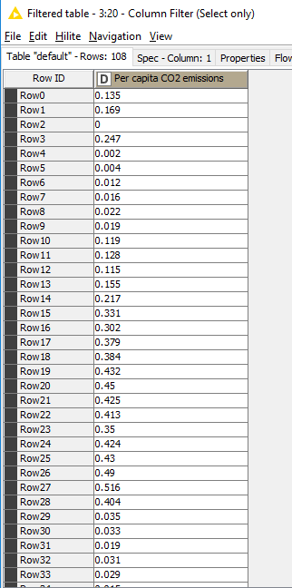

Introduction
===

(Work prepared by [E.MaragKoudakis](mailto:Emmanouil.MARAGKOUDAKIS@ext.ec.europa.eu))

The aim of this workflow is to demonstrate how one can use R code to perform anomaly detection, using the `tsoutliers R` package and integrate it to `KNIME`, 
in order to help identifying outliers in a dataset and either replace them with an averaging value or remove them. 
The data used for the task-at-hand is the *"Carbon dioxide (CO₂) emissions from the burning of fossil fuels for energy and cement production"* dataset found in 
[here](https://ourworldindata.org/grapher/co-emissions-per-capita) and [there](https://datamotus.com/2019-11-15-Outlier-Detection_files/co-emissions-per-capita.csv).

Outlier detection
---

Time series data often undergo sudden changes that alter the dynamics of the data transitory or permanently. These changes are typically non systematic and
cannot be captured by standard time series models. That's why they are known as exogenous or outlier effects. Detecting outliers is important because they have
an impact on the selection of the model, the estimation of parameters and, consequently, on forecasts.

Following the approach described in Chen & Liu (1993), an automatic procedure for detection of outliers in time series is implemented in the package tsoutliers. 
The procedure may in turn be run along with the automatic ARIMA model selection strategy available in the package forecast.

The function `tso` is the main interface for the automatic procedure. The functions `locate.outliers.oloop` and `remove.outliers` implement respectively the first 
and second stages of the procedure. In practice, the user may stick to use the function `tso`.

Although the purpose of the package is to provide an automatic procedure, the implementation allows the user to do a manual inspection of each step of the procedure. 
Thus, the package is also useful to track the behaviour of the procedure and come up with ideas for possible improvements or enhancements.

The functions `locate.outliers.oloop` and `remove.outliers` implement the major steps of the procedure. `tso` is the main interface to the automatic procedure. 
All the options at any stage of the procedure can be defined through the arguments passed to tso. Despite the user may stick to use the function tso, other 
functions called by this main interface are exported in the namespace of the package. They are helpful for debugging and allow the interested user to more easily 
track each step of the procedure.

Information supplemental to these help pages is given in the document that is provided with the package ("tsoutliers/inst/doc/" in the source files).

Dataset information
---

Human emissions of carbon dioxide and other greenhouse gases – are a primary driver of climate change – and present one of the world's most pressing challenges. 
This link between global temperatures and greenhouse gas concentrations – especially CO2 – has been true throughout Earth's history.

To set the scene, let’s look at how the planet has warmed. In the chart we see the global average temperature relative to the average of the period between 1961
and 1990.

The red line represents the average annual temperature trend through time, with upper and lower confidence intervals shown in light grey.

We see that over the last few decades, global temperatures have risen sharply — to approximately 0.7℃ higher than our 1961-1990 baseline. 
When extended back to 1850, we see that temperatures then were a further 0.4℃ colder than they were in our baseline. Overall, this would amount to an average 
temperature rise of 1.1℃.

Because there are small year-to-year fluctuations in temperature, the specific temperature increase depends on what year we assume to be 're-industrial' nd the 
end year we’re measuring from. But overall, this temperature rise is in the range of 1 to 1.2℃

Implementation
---

The architecture of the workflow is depicted below:
<!--  -->


You can download the workflow from here (*TO BE ADDED*).

User Story
---

The country code and the starting year is inserted by the user using a KNIME component. Data is filtered according to the preferences of the user and the 
CO2 emission column is sent to `R` code in order for the tso function to execute, plot the anomalies and extract the indices of the outliers. 
Since tso starts the numbering from 1 and the original data have other indices, we ask knime to create a new RowID, we uniform the row id code for 
the original and the anomalous data and using the inner join node we extract the year that corresponds to all anomalies.

**Source data:**
<!--  -->


**Use-selection in `KNIME` component:**
<!--  -->


**R code for outlier detection:**
```R
library(tsoutliers)
rframe <- knime.in
dat.ts<- ts(rframe,frequency=3)
data.ts.outliers <- tso(dat.ts)
```

**Plot of the anomalies:**
<!--  -->


**Outliers list:**
<!--  -->


**Outliers joined with the initial dataset:**
<!--  -->


Software/data resources
---
* More information regarding data on [CO₂ emission and-other-greenhouse-gas-emissions](https://ourworldindata.org/co2-and-other-greenhouse-gas-emissions)
 and [co-emissions-per-capita](https://ourworldindata.org/grapher/co-emissions-per-capita), including 
[Carbon dioxide (CO₂) emissions from the burning of fossil fuels for energy and cement production](https://datamotus.com/2019-11-15-Outlier-Detection_files/co-emissions-per-capita.csv)
* `TSoutliers` [CRAN package](https://cran.r-project.org/web/packages/tsoutliers/index.html) and 
[manual](https://cran.r-project.org/web/packages/tsoutliers/tsoutliers.pdf).


References
---
* Chen, C. and Liu, L.-M. (1993): **Joint estimation of model parameters and outlier effects in time series**, 
_Journal of the American Statistical Association_, 88(421):284-297, doi:[10.1080/01621459.1993.10594321](https://doi.org/10.1080/01621459.1993.10594321).
* Chen, C. and Liu, L.-M. (1993): **Forecasting time series with outliers**,  _Journal of Forecasting_, 
12(1):13-35, doi:[10.1002/for.3980120103](https://doi.org/10.1002/for.3980120103).
